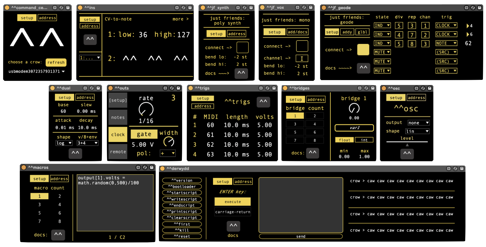

# crow-m4l
Max for Live devices for crow (monome/whimsical raps). See [the bundled PDF](https://github.com/monome/crow-max-and-m4l/blob/main/crowm4lmanual%20-%20230310.pdf) to get started.

Interested in using crow with Max standalone? Download the monome package (version 1.1.0 or later) from the [Max Package Manager](https://docs.cycling74.com/max8/vignettes/package_manager).